#### Однажды две прекрасные филологини перевоплотились в двух не менее прекрасных обитателей дикой и недикой природы, чтобы завести свои интернет-дневники. Мы решили проанализировать их и понять, что происходило с авторками (и всеми нами) в период февраль-май 2020. Итак... мы начинаем битву животных! Впереди вас ждёт невероятное путешествие в личную жизнь двух филологинь (они на то дали нам своё согласие).

### мы собрали все посты двух пабликов с февраля по март 2020, и они превратились в два наших корпуса.

### здесь мы старательно пользовались mystem, чтобы лемматизировать девочек.
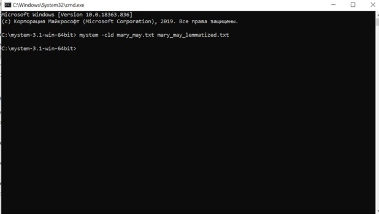
### и вышло довольно забавно:)
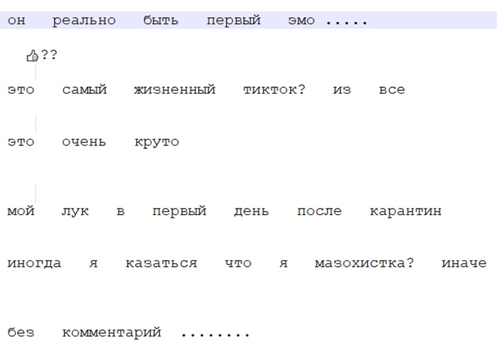
### потом мы отправились в AntConc, чтобы найти самые частотные лексемы для каждого из корпусов; не забыли подгрузить стоп-слова. Мы визуализировали топ-25 в виде облака тэгов в WordArt. 
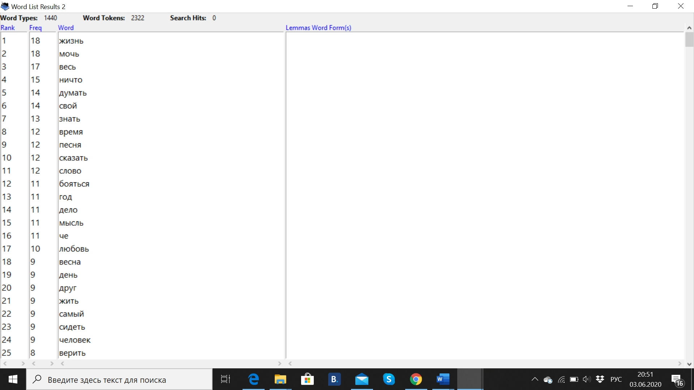

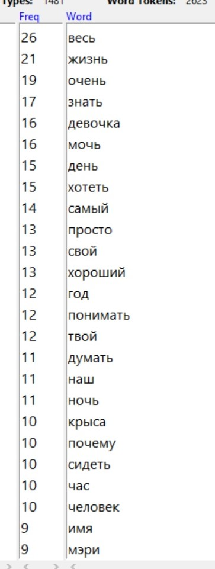

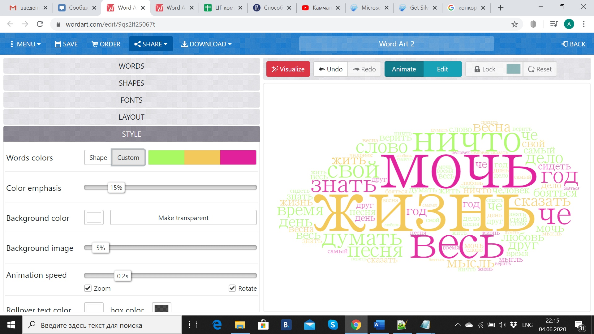 

### видно, что самые частые размышления у обеих авторок - о всей жизни. Есть и отличия: у первой филологини особую групу слов составляют "время", "песня", "слово", "мысль", "любовь", "весна" и прекрасное "че", а вторая часто пишет о "девочке", "ночи", "крысе" и "человеке", спрашивает "почему". Заметили и особенности употребления "базовых глаголов": для первой филологини характерно "бояться", а для второй - "хотеть".  Пунктиром начинаем вырисовывать портреты филологинь: героиня-весна и героиня готическая.

### дальше мы решили поработать с конкордансами в AntConc и посмотреть, что именно наши героини пишут о жизни:

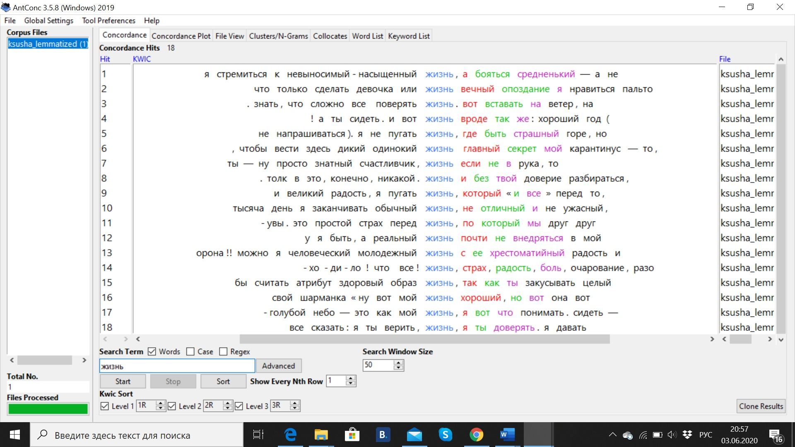

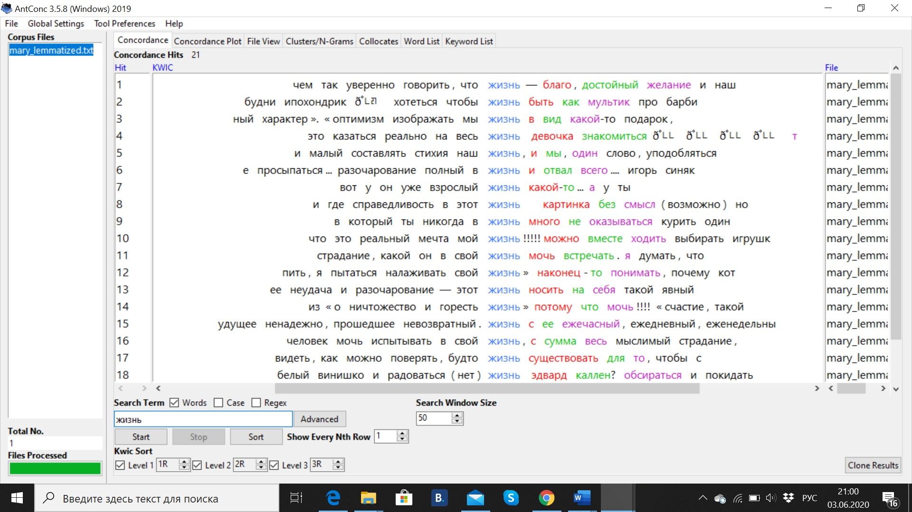

### что они знают:

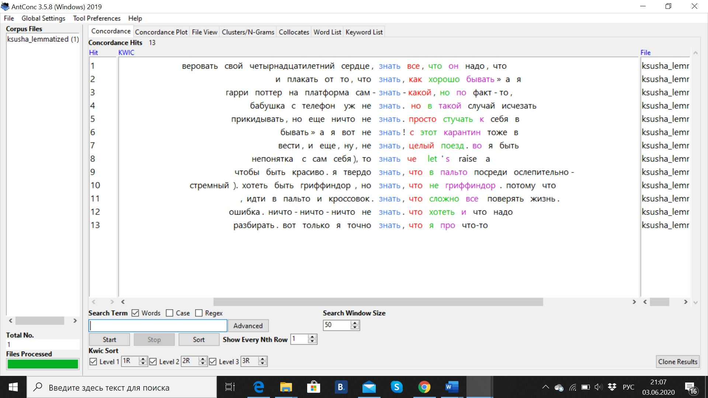

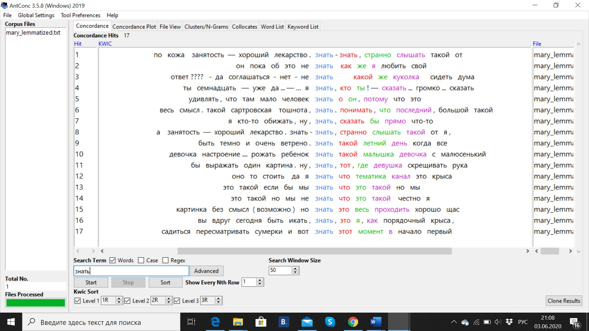

### и что могут:

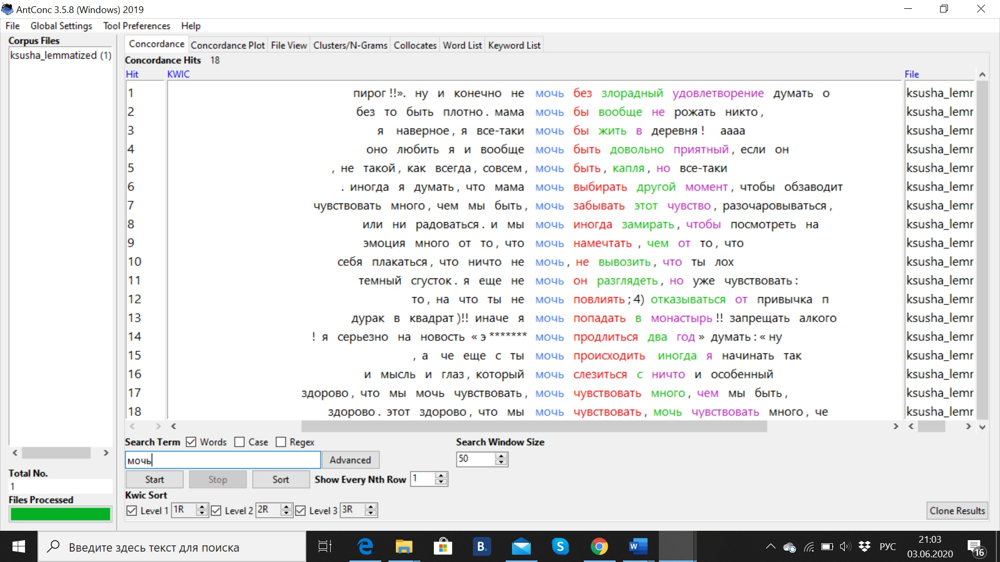

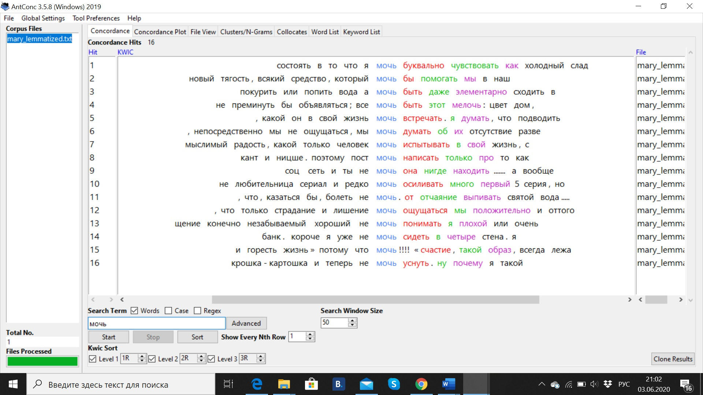

### здесь то, о чем первая авторка писала в (слева направо) феврале, апреле, марте и мае
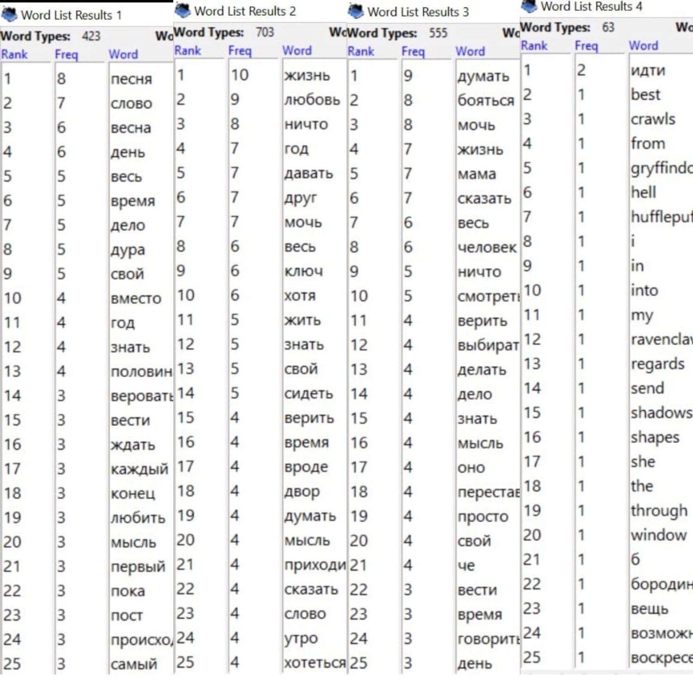

