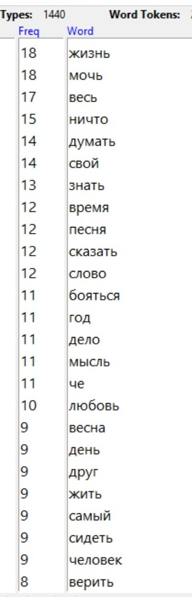
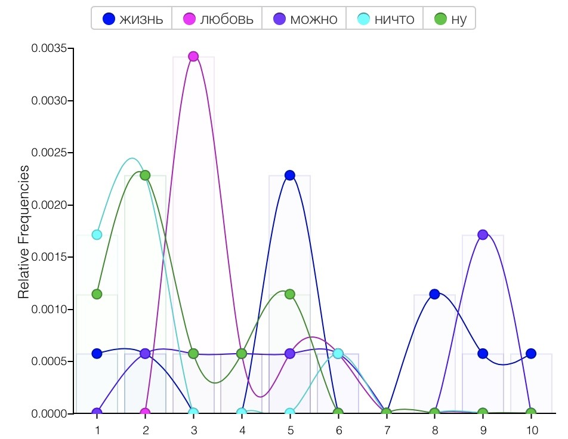

#### Однажды две прекрасные филологини перевоплотились в двух не менее прекрасных обитателей дикой и недикой природы, чтобы завести свои интернет-дневники. Мы решили проанализировать их и понять, что происходило с авторками (и всеми нами) в период февраль-май 2020. Итак... мы начинаем битву животных! Впереди вас ждёт невероятное путешествие в личную жизнь двух филологинь (они на то дали нам своё согласие).
***

### Мы собрали все посты двух пабликов с февраля по март 2020, и они превратились в два наших корпуса.

### Здесь мы старательно пользовались MyStem, чтобы лемматизировать девочек:

### и вышло довольно забавно:)

### Потом мы отправились в AntConc, чтобы найти самые частотные лексемы для каждого из корпусов; не забыли подгрузить стоп-слова:

### Мы визуализировали топ-25 в виде облака тэгов в WordArt:
 

### Видно, что самые частые размышления у обеих авторок - о всей жизни. Есть и отличия: у первой филологини особую группу слов составляют "время", "песня", "слово", "мысль", "любовь", "весна" и прекрасное "че", а вторая часто пишет о "девочке", "ночи", "крысе" и "человеке", спрашивает "почему". Заметили и особенности употребления "базовых глаголов": для первой филологини характерно "бояться", а для второй - "хотеть".  Пунктиром начинаем вырисовывать портреты филологинь: героиня весенняя и героиня готическая.

### Дальше мы решили поработать с конкордансами в AntConc и посмотреть, что именно наши героини пишут о жизни:

### что они знают:

### и что могут:

### Здесь то, о чем героиня весенняя писала в (слева направо) феврале, апреле, марте и мае:

### Видно, что в апреле в топ попали слова с негативной окраской: видимо, сказывается месяц самоизоляции. 

### А тут спрятано имя героини готической и частые мотивы её дневника по месяцам (они, напротив, распределены достаточно равномерно):
.jpg)

### Но давайте рассмотрим подробнее, что происходило с нашими авторками на протяжении почти полугода: 
###  Февраль:
 
### Героиня мечтает о наступлении весны:
### 1) Она пишет, что она все-таки ребенок весны, но потом ей будет не хватать жизни и, соответственно, голубого неба, как мы заметим позже.
### 2) Зима ей невмоготу, она ждет весну.
###  Март:
 
### В марте она особенно много пишет про любовь, потому что мы наконец-то дождались весны. Она радуется тому, что в мире теперь одна сплошная любовь. А слово "можно" говорит об огромном спектре возможностей, который открылся (но ненадолго...)
###  Апрель:
 
### Слово «бояться», очень часто употребляется в апреле. Уже на карантине, во время вспышки заболеваемости коронавирусной инфекции в Москве, она стала чаще писать про свои страхи. Коронавирус повлияла на ее психологическое состояние.
### Май:
 
### В мае героиня почти ничего не пишет, вероятно, из-за дедлайнов и учебы у нее просто нет на это времени. Тем не менее, несколько раз повторяется слов «идти»: героине уже тяжело сидеть дома, на одном месте.
### С февраля по май:
 
### Слово «мир» часто употребляется (вероятно, из-за коронавируса):
### 1) Филология рада, что в мире много любви.
### 2) Мир и вирус в одном предложении, что подтверждает догадку.
### 3) «Не внедряться в мой мир» - филологиня привыкает к домашнему режиму.
### 4) Опять же, она хочет обнять весь мир.
***
### Слово «жизнь»:
### 1) Она стремится к насыщенной жизни
### 2) Героиня сравнивает жизнь и голубое небо. Вероятно, на карантине ей не хватает неба, и она уже не чувствует себя живой в четырех стенах.
### 3) В предложении о кранатине она пишет, что ведет теперь дикий и одинокий образ жизни.

### Февраль у героини готической:

### 1) Цитата из «Портрета Дориана Грея» про сигареты с фотографией курящей крысы. Дама явно питает слабость к этим милым зверькам.
### 2) Обращение «девочки», как излюбленный способ начинать повествование. В феврале филологиня много рассказывает нам про свои пьяные похождения и признается, что женщины – «лучшее, что есть в этой жизни».
### Март:

### 1) Весна наступает и в душе филологини. Она радуется жизни и восхищается всем вокруг: пишет о «хороших женщинах», «хороших подарках», «хороших мужчинах», «хороших людях» и даже о «хороших детях». 
### 2) Слово «самый» с наступлением весны употребляется только в положительном контексте: «самый лучший», «самый вкусный», «самый жизнеутверждающий».
### 3) И хотя в жизни нашей героини все хорошо, она часто вспоминает прошлое, она «хочет весну 2019». Все ее желания так или иначе связаны с ее прошлым.
###  Апрель:

### 1). Как и в марте, филологиня часто вспоминает прошлое. Слово «год» всегда встречается в этом контексте: «год назад», «в тот год» и т.д. Видимо, воспоминания являются ее единственным утешением во время карантина.

### 2). Кроме того, в феврале девушка, любящая крыс, неудачно влюбляется. Слово «даже» чаще всего употребляется, когда героиня рассказывает о своей личной жизни. К примеру, «он даже не…».

### 3). Героиня также много думает о жизни. Она цитирует Шопенгауэра, что свидетельствует о том, что она хандрит и депрессует. По-видимому, на ее настроение влияет карантин и неудача в личной жизни.
###  Май
 
### В мае слово «пара» чаще всего употребляется в негативном контексте: студентка ничего не успевает, злится и устает. Это вполне логично, учитывая, что учебный год подходит к концу и все филологи загружены работой. Мы видим, что времени для мыслей об отношениях и смысле жизни у нее не остается.
### Февраль -- май у второй героини:
 
### Слово «жизнь»:
### 1). Размышления о жизни и будущем
### 2) Цитаты о смысле жизни
### 3). Мемы «моя жизнь + смешная картинка»
### 4). Слово «жизненно» как производное от слова «жизнь»
***
### Слово «очень». Контексты употребления:
### 1). Об эмоциях и состоянии: «очень рада», «очень счастлива», «очень грустно», «очень пьяная»
### 2). Оценочное суждение: «очень круто», «очень сильно», «очень хорошо».
### 3). О погоде: «очень ветрено», «очень холодно», «очень жарко»,
***
### Слово «день». Контексты употребления:
### 1). Рассказ о  сегодняшнем дне.
### 2). Воспоминания о прошлом.

.
.
.

### Сравнение двух дневников:
### Во время карантина обе филологини хандрят и много думают о жизни. Кроме того, они обе склонны к ипохондрии. Девушки любят весну, но страдают из-за необходимости сидеть дома. Вообще карантин очень сильно влияет на их эмоциональный фон и дается им с трудом. В мае обе героини загружены учебой, времени на думы о смысле жизни и ведение дневника у них почти не остается.

### Представляем рубрику "о чём кричат филологини" (а точнее - сколько). Мы подсчитали с помощью регулярного выражения все слова, заканчивающиеся на "!". Героиня весенняя оказалась более эмоциональной:

### И вот такие вот красивые словестные портреты девочек у нас получились!

