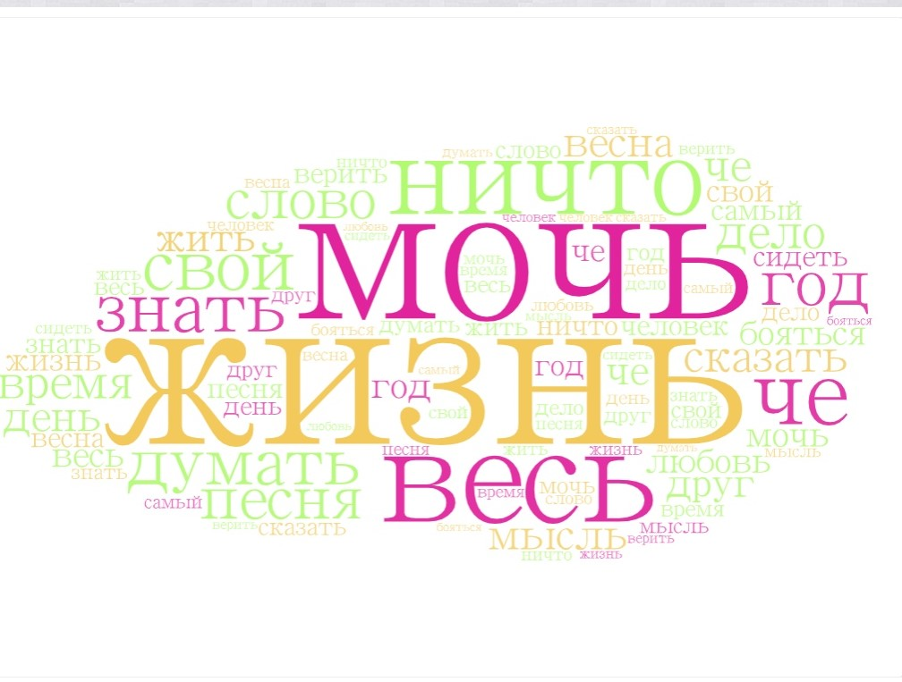

#### Однажды две прекрасные филологини перевоплотились в двух не менее прекрасных обитателей дикой и недикой природы, чтобы завести свои интернет-дневники. Мы решили проанализировать их и понять, что происходило с авторками (и всеми нами) в период февраль-май 2020. Итак... мы начинаем битву животных! Впереди вас ждёт невероятное путешествие в личную жизнь двух филологинь (они на то дали нам своё согласие).

### Мы собрали все посты двух пабликов с февраля по март 2020, и они превратились в два наших корпуса.

### Здесь мы старательно пользовались MyStem, чтобы лемматизировать девочек:

### и вышло довольно забавно:)

### Потом мы отправились в AntConc, чтобы найти самые частотные лексемы для каждого из корпусов; не забыли подгрузить стоп-слова:

### Мы визуализировали топ-25 в виде облака тэгов в WordArt:
 

### Видно, что самые частые размышления у обеих авторок - о всей жизни. Есть и отличия: у первой филологини особую группу слов составляют "время", "песня", "слово", "мысль", "любовь", "весна" и прекрасное "че", а вторая часто пишет о "девочке", "ночи", "крысе" и "человеке", спрашивает "почему". Заметили и особенности употребления "базовых глаголов": для первой филологини характерно "бояться", а для второй - "хотеть".  Пунктиром начинаем вырисовывать портреты филологинь: героиня весенняя и героиня готическая.

### Дальше мы решили поработать с конкордансами в AntConc и посмотреть, что именно наши героини пишут о жизни:

### что они знают:

### и что могут:

### Здесь то, о чем героиня весенняя писала в (слева направо) феврале, апреле, марте и мае:

### Видно, что в апреле в топ попали слова с негативной окраской: видимо, сказывается месяц самоизоляции. 

### А тут спрятано имя героини готической и частые мотивы её дневника по месяцам (они напротив, распределены достаточно равномерно):
.jpg)
